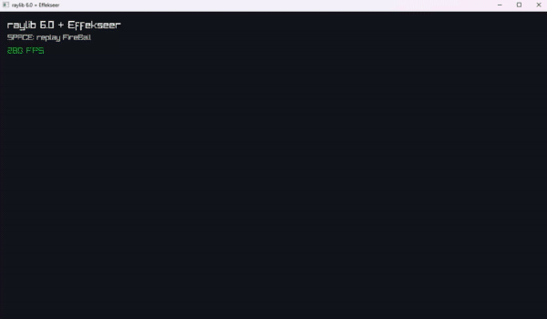

# raylib-effekseer

## Example



## Example Code

> [!IMPORTANT] Rayseer::Draw() should be called outside BeginMode3D() / EndMode3D().

```cpp
#include "rayseer.h"

#include "raylib.h" //もし必要なら 

int main()
{
    InitWindow(1280, 720, "Rayseer Example");

    if (!Rayseer::Initialize())
    {
        CloseWindow();
        return 1;
    }

    Rayseer::EffectAsset effect =
        Rayseer::LoadEffect("resource/FireBall.efkefc");

    if (!Rayseer::IsEffectLoaded(effect))
    {
        Rayseer::Shutdown();
        CloseWindow();
        return 1;
    }

    Camera3D camera{};
    camera.position = { 8.0f, 6.0f, 10.0f };
    camera.target = { 0.0f, 1.0f, 0.0f };
    camera.up = { 0.0f, 1.0f, 0.0f };
    camera.fovy = 45.0f;
    camera.projection = CAMERA_PERSPECTIVE;

    Rayseer::PlayEffect(effect, { 0.0f, 1.0f, 0.0f });

    while (!WindowShouldClose())
    {
        Rayseer::Update(GetFrameTime());

        BeginDrawing();
        ClearBackground(BLACK);

        Rayseer::Draw(camera);

        EndDrawing();
    }

    Rayseer::UnloadEffect(effect);
    Rayseer::Shutdown();

    CloseWindow();
    return 0;
}
```